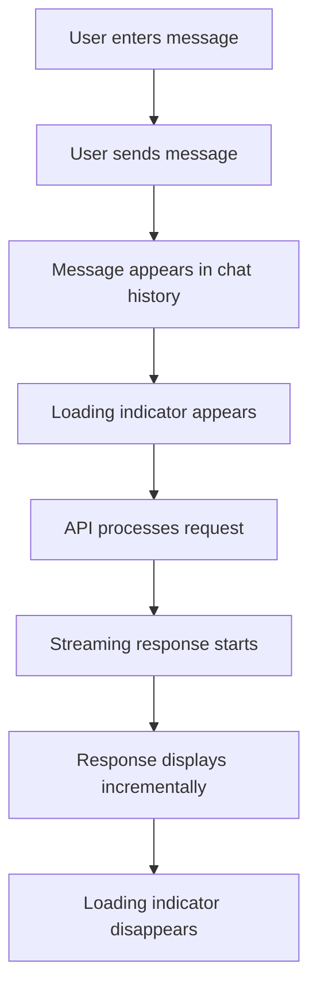

## 1. Product Overview
A simple chat interface for testing OpenRouter free model API integration
- Allows users to send messages and receive streaming responses from the OpenRouter API
- Target users: Developers testing OpenRouter API integration

## 2. Core Features

### 2.1 User Roles
| Role | Registration Method | Core Permissions |
|------|---------------------|------------------|
| User | No registration required | Send messages and view chat history |

### 2.2 Feature Module
1. **Chat Page**: Message input, chat history, loading indicator, streaming response display

### 2.3 Page Details
| Page Name | Module Name | Feature description |
|-----------|-------------|---------------------|
| Chat Page | Message Input | Text input field for user messages, send button |
| Chat Page | Chat History | Display of previous messages with user/AI distinction |
| Chat Page | Loading Indicator | Spinner animation while waiting for API response |
| Chat Page | Streaming Response | Real-time display of AI response as it arrives |

## 3. Core Process
1. User enters a message in the input field
2. User clicks send button or presses Enter
3. Message appears in chat history as user message
4. Loading indicator appears while API processes request
5. AI response appears in chat history as streaming text
6. Loading indicator disappears when response completes

## 4. User Interface Design
### 4.1 Design Style
- Primary color: #3b82f6 (blue)
- Secondary color: #10b981 (green)
- Button style: Rounded corners, subtle hover effect
- Font: Inter, sans-serif
- Layout style: Clean, minimalistic chat interface
- Icon style: Simple, linear icons

### 4.2 Page Design Overview
| Page Name | Module Name | UI Elements |
|-----------|-------------|-------------|
| Chat Page | Message Input | Text input field with placeholder, send button with paper plane icon |
| Chat Page | Chat History | Message bubbles with distinct styles for user and AI, timestamp, smooth scrolling |
| Chat Page | Loading Indicator | Circular spinner animation, positioned near AI message bubble |
| Chat Page | Streaming Response | Text appears word by word, with subtle fade-in effect |

### 4.3 Responsiveness
- Desktop-first design
- Mobile-adaptive layout
- Touch optimization for mobile devices
- 14-inch screen optimization

### 4.4 3D Scene Guidance
Not applicable